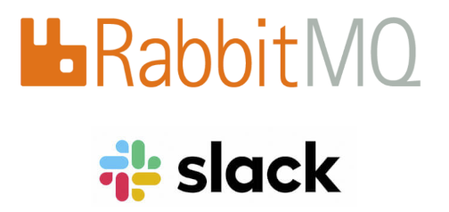

# 37SCJ-Consumer-apihemocentro

Projeto criado com objetivo de consumir mensagens na fila do RabbitMQ.

##  Pré-requisitos para execução do projeto
- Tecnologias necessárias.

  1- Para executar os projetos é necessário ter instalado Java SE Development Kit versão 11 e o Node JS.
  
  2- Utilizar uma IDE para execução dos projetos de API desenvolvida em Java. Ex. IntelliJ ou Eclipse.
 

## Download do projeto

- Baixar o projeto: `$ git clone https://github.com/teixeira308/consumer-apihemocentro.git`
---

## Instruções execução dos projetos

### 1) Instalação e execução do projeto
Esse projeto tem como objetivo de consumir a fila do RabbitMQ e enviar e-mail e postar na fila do slack.

- Importar o projeto (Ex. Eclipse)

  1- No Eclipse, selecione **File > Import...**.
  
  2- Na janela de importação, expandir Maven, selecione **Existing Maven Projects**, e clicar **Next**.
  
  3- Clicar em **Browse** e entre na pasta do projeto **Consumer-apihemocentro**, onde contém o **pom.xml** que você deseja importar.
  
  4- Clicar em **Finish**. O Eclipse vai importar o projeto e iniciar o download dos recursos requeridos.
  
  5- Entre no Package **com.apihemocentro.main** e clique na classe Java **Consumer.java** e clique em **Run**.
  
